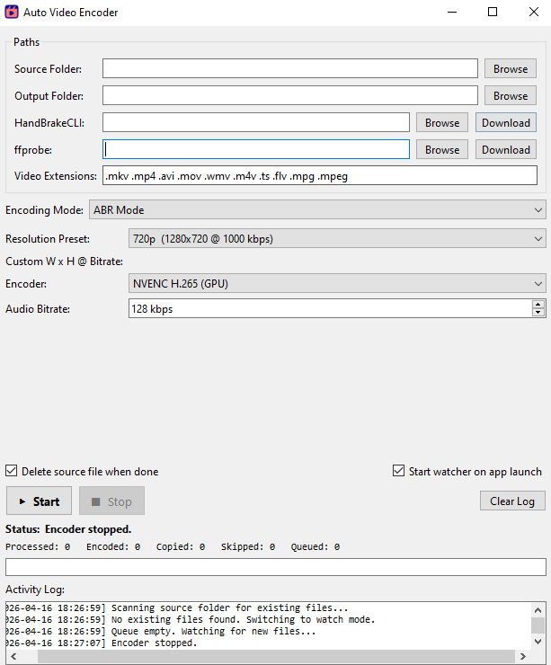

# Auto Video Encoder

A desktop application that monitors folders and automatically encodes video files using [HandBrakeCLI](https://handbrake.fr/). Built with Python and PySide6 (Qt), it supports GPU-accelerated encoding via NVIDIA NVENC as well as CPU-based x265/x264 encoders.

## Features

- **Folder watching** -- monitors a source directory (including subfolders) for new video files and encodes them automatically
- **Startup scan** -- processes all existing files in the source folder before switching to watch mode
- **Three encoding modes:**
  - **ABR** -- Average Bitrate with resolution presets (480p through 8K)
  - **CRF** -- Constant Rate Factor for quality-based encoding
  - **Advanced** -- full control over video, audio, picture, filters, subtitles, and container settings
- **GPU & CPU encoders** -- NVENC H.265, x265, x264, and many more
- **Smart skip logic:**
  - Files below the target resolution are copied without encoding
  - Pre-encode bitrate prediction skips files already at or below the target bitrate
  - Post-encode size check keeps the original if the encoded file is larger
- **Container-aware output** -- preserves `.mp4` and `.mkv` extensions; converts legacy formats (`.avi`, `.mov`, `.wmv`, etc.) to MKV
- **Auto-download tools** -- downloads HandBrakeCLI and ffprobe on first launch if not already installed
- **System tray integration** -- minimizes to tray on close, keeps running in the background
- **Headless mode** -- run without GUI via `--headless` for server/daemon use
- **Persistent config** -- all settings saved to `config.json` and restored on next launch

## Download

Pre-built binaries are available on the [Releases](https://github.com/redaapps4fun/auto-video-encoder/releases/latest) page:

| Platform | Download |
|----------|----------|
| Windows  | [`AutoVideoEncoder-Windows.exe`](https://github.com/redaapps4fun/auto-video-encoder/releases/latest/download/AutoVideoEncoder-Windows.exe) |
| Linux    | [`AutoVideoEncoder-Linux`](https://github.com/redaapps4fun/auto-video-encoder/releases/latest/download/AutoVideoEncoder-Linux) |
| macOS    | [`AutoVideoEncoder-macOS.zip`](https://github.com/redaapps4fun/auto-video-encoder/releases/latest/download/AutoVideoEncoder-macOS.zip) |

> The builds are not code-signed. Your OS will likely show a security warning the first time you run the app. See [Running Unsigned Builds](#running-unsigned-builds) below for how to bypass this on each platform.

## Screenshots



## Requirements

- **Windows 10/11**, macOS, or Linux
- **Python 3.10+**
- **HandBrakeCLI** -- downloaded automatically, or [manually from handbrake.fr](https://handbrake.fr/downloads2.php)
- **ffprobe** (part of ffmpeg) -- downloaded automatically, or [manually from ffmpeg.org](https://ffmpeg.org/download.html)
- **NVIDIA GPU** (optional) -- GTX 600-series or newer for NVENC hardware encoding

## Installation

### From Source

```bash
git clone https://github.com/redaapps4fun/auto-video-encoder.git
cd auto-video-encoder

python -m venv .venv

# Windows
.venv\Scripts\activate

# macOS / Linux
source .venv/bin/activate

pip install -r requirements.txt
python main.py
```

### Build Standalone Executable

```bash
python build.py              # one-folder build (default)
python build.py --onefile    # single-file .exe
python build.py --console    # keep console window visible for debugging
```

The compiled executable appears in `dist/AutoVideoEncoder/`.

## Usage

### GUI Mode (default)

```bash
python main.py
```

1. Set the **Source Folder** to the directory you want to monitor
2. Set the **Output Folder** where encoded files will be saved (subfolder structure is mirrored)
3. Choose an **Encoding Mode** (ABR, CRF, or Advanced) and configure settings
4. Click **Start** to begin the startup scan and folder watcher

If HandBrakeCLI or ffprobe are not found, a setup dialog will offer to download them automatically.

### Headless Mode

```bash
python main.py --headless
```

Runs without a GUI window. All output goes to the console. Useful for servers or background operation. Configure settings in `config.json` before starting.

### Auto-Start Watcher on Launch

```bash
python main.py --auto-start
```

Or enable the "Start watcher on app launch" checkbox in the GUI.

## Configuration

Settings are stored in `config.json` next to the executable (or in `%LOCALAPPDATA%\AutoVideoEncoder\` for compiled builds). Key options:

| Setting | Description | Default |
|---|---|---|
| `source_base` | Folder to watch for new video files | *(empty)* |
| `output_base` | Root folder for encoded output | *(empty)* |
| `encoding_mode` | `abr`, `crf`, or `advanced` | `abr` |
| `delete_source` | Delete source file after processing | `true` |
| `replace_in_place` | Overwrite source file instead of using output folder | `false` |
| `auto_start_watcher` | Start encoding on app launch | `false` |
| `video_extensions` | File extensions to process | `.mkv .mp4 .avi .mov .wmv .m4v .ts .flv .mpg .mpeg` |

### ABR Presets

| Preset | Resolution | Video Bitrate |
|---|---|---|
| 480p | 854x480 | 400 kbps |
| 720p | 1280x720 | 1,000 kbps |
| 1080p | 1920x1080 | 2,000 kbps |
| 1440p | 2560x1440 | 4,000 kbps |
| 4K UHD | 3840x2160 | 8,000 kbps |
| 8K | 7680x4320 | 30,000 kbps |

## Project Structure

```
Auto Video Encoder/
├── main.py              # Entry point (GUI and headless modes)
├── config.py            # ConfigManager with defaults and INI migration
├── encoder_engine.py    # QThread-based folder watcher and encoding state machine
├── handbrake.py         # HandBrakeCLI argument builder and process runner
├── ffprobe.py           # Resolution, duration, and bitrate detection
├── tools.py             # Auto-download manager for HandBrakeCLI and ffprobe
├── build.py             # PyInstaller build script
├── requirements.txt     # Python dependencies
├── ui/
│   ├── main_window.py   # Primary application window
│   ├── mode_abr.py      # ABR encoding mode panel
│   ├── mode_crf.py      # CRF encoding mode panel
│   ├── mode_advanced.py # Advanced encoding mode panel
│   ├── tools_setup.py   # First-run tool download dialog
│   ├── tray_icon.py     # System tray icon and menu
│   └── resources.py     # Presets, encoder lists, and constants
└── config.json          # User settings (auto-generated)
```

## How It Works

1. **Scan** -- On start, the engine walks the source folder recursively and queues all video files
2. **Lock check** -- Before processing, each file is tested for read access (retries up to 12 times at 5-second intervals to wait for incomplete downloads)
3. **Probe** -- ffprobe reads the file's resolution, duration, and calculates its bitrate
4. **Skip decision** -- If the source resolution is below the target, or the bitrate is already at/below the target, the file is copied as-is
5. **Encode** -- HandBrakeCLI encodes to a temp file; real-time progress is streamed to the GUI
6. **Size check** -- If the encoded file is larger than the original, the original is kept instead
7. **Output** -- The result is moved to the output folder (mirroring the subfolder structure) and the source is optionally deleted
8. **Watch** -- After the initial scan, the engine polls the source folder every 2 seconds for new files

## Running Unsigned Builds

The release binaries are not code-signed, so your operating system may flag them as untrusted. Here's how to get past the warning on each platform.

### Windows — SmartScreen Warning

When you run the `.exe` for the first time, Windows may show **"Windows protected your PC"**.

1. Click **"More info"**
2. Click **"Run anyway"**

This only happens once. After the first launch, Windows remembers your choice.

### macOS — Gatekeeper Block

macOS will show **"AutoVideoEncoder can't be opened because Apple cannot check it for malicious software"**.

1. Unzip `AutoVideoEncoder-macOS.zip`
2. Try to open `AutoVideoEncoder.app` — it will be blocked
3. Open **System Settings → Privacy & Security**
4. Scroll down — you'll see a message about AutoVideoEncoder being blocked
5. Click **"Open Anyway"** and confirm

Alternatively, remove the quarantine attribute from Terminal before opening it:

```bash
xattr -cr /path/to/AutoVideoEncoder.app
```

### Linux — Permission Denied

The downloaded binary may not have execute permission:

```bash
chmod +x AutoVideoEncoder-Linux
./AutoVideoEncoder-Linux
```

No signing warnings on Linux — the file just needs to be marked as executable.

## License

Licensed under the [Apache License 2.0](LICENSE).
